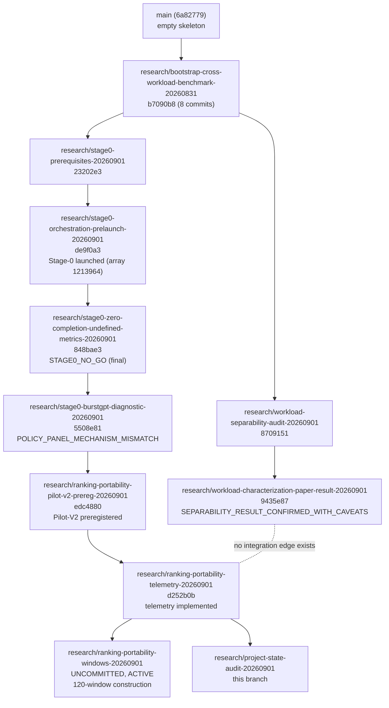

# BRANCH_MAP.md — Branch Lineage

Derived from actual git ancestry (`git log --oneline main..<branch>`,
`git merge-base`), not from branch names. `main` (`6a82779`) is an empty
skeleton — no research branch has been merged into it.

## Lineage graph

**Critical structural fact**: `research/workload-characterization-paper-result-20260901` and the Stage-0→ranking-portability lineage are **siblings from a common ancestor (`b7090b8`), never integrated with each other.** Neither contains the other's unique work. This is not a bug, but it means no single branch currently holds the complete project — see "Integration recommendation" below.

## Per-branch detail

| Branch | HEAD SHA | Parent (by ancestry) | Purpose | Unique contribution (commits not in parent) | Supersedes | Superseded by | Merge status | Preserve? |
|---|---|---|---|---|---|---|---|---|
| `main` | `6a82779` | — | Public/eventual release target | Repo skeleton only | — | — | N/A | Yes (never touch except at actual release) |
| `research/bootstrap-cross-workload-benchmark-20260831` | `b7090b8` | `main` | Project bootstrap, overlap audit, Stage-0 window infra | `255caca`…`b7090b8` (8 commits: RQs, overlap ledger, Stage-0 window-selection code, characterization experiment, SLURM handoff doc) | — | Fully contained in every downstream branch | Not merged | Yes — common ancestor, and the only worktree still carrying the original dirty local state (see Worktree Audit) |
| `research/workload-separability-audit-20260901` | `8709151` | `research/bootstrap-...` | Diagnose near-zero permutation importances despite balanced_accuracy=1.0 | `8709151` (1 commit) | — | `research/workload-characterization-paper-result-20260901` (which contains this commit as an ancestor) | Not merged | Yes (historical audit trail) |
| `research/workload-characterization-paper-result-20260901` | `9435e87` | `research/workload-separability-audit-...` | Final, paper-facing, leakage-resistant characterization result | `9435e87` (1 commit) | `research/workload-separability-audit-20260901`'s own standing as "current" | — | **Not merged into the active lineage** | **Yes — contains findings not present anywhere else; needs integration before manuscript finalization** |
| `research/stage0-prerequisites-20260901` | `23202e3` | `research/bootstrap-...` | Real data acquisition + load calibration bootstrap | `3b7caa6`, `23202e3` (2 commits) | — | Fully contained in every downstream Stage-0 branch | Not merged | Yes (ancestor) |
| `research/stage0-orchestration-prelaunch-20260901` | `de9f0a3` | `research/stage0-prerequisites-...` | Stage-0 harness build + real 1,080-cell launch | `aad9a1d`…`de9f0a3` (8 commits) | — | Fully contained downstream | Not merged | Yes (ancestor; also the worktree holding the authoritative raw Stage-0 result cells and SLURM logs on Wulver) |
| `research/stage0-zero-completion-undefined-metrics-20260901` | `848bae3` | `research/stage0-orchestration-prelaunch-...` | Metric-boundary repair + final `STAGE0_NO_GO` verdict | `43277e0`, `848bae3` (2 commits) | — | Fully contained downstream | Not merged | Yes (ancestor; final Stage-0 scientific record) |
| `research/stage0-burstgpt-diagnostic-20260901` | `5508e81` | `research/stage0-zero-completion-...` | Root-cause diagnosis of Criterion 5's failure | `5508e81` (1 commit) | — | Fully contained downstream | Not merged | Yes (ancestor; diagnostic evidence) |
| `research/ranking-portability-pilot-v2-prereg-20260901` | `edc4880` | `research/stage0-burstgpt-diagnostic-...` | Pilot-V2 preregistration (protocol, panel, analysis plan, metric definitions, manuscript contract) | `edc4880` (1 commit) | — | Fully contained downstream | Not merged | Yes (ancestor; frozen preregistration) |
| `research/ranking-portability-telemetry-20260901` | `d252b0b` | `research/ranking-portability-pilot-v2-prereg-...` | Mechanism-telemetry schema + collection path | `d252b0b` (1 commit) | — | None yet | Not merged | **Yes — latest fully-committed authoritative tip of the active lineage** |
| `research/ranking-portability-windows-20260901` | uncommitted | `research/ranking-portability-telemetry-...` | Pilot-V2 120-window construction | Extension-sampling algorithm + real build (in progress) | — | None | Not pushed | Yes once committed — do not discard the in-progress Wulver run |
| `research/project-state-audit-20260901` | this commit | `research/ranking-portability-telemetry-...` | This status audit | Status documentation only | — | — | Not merged | Yes |

## Integration recommendation

Before manuscript finalization (Milestone 8, `docs/PROJECT_ROADMAP.md`),
merge or cherry-pick `research/workload-characterization-paper-result-20260901`'s
two commits (`8709151`, `9435e87`) onto the active lineage (currently
`research/ranking-portability-windows-20260901` once complete, or
whatever branch is the active tip at that time) — a pure documentation/
code consolidation with no scientific content change, since both
lineages share the same `b7090b8` ancestor and the characterization work
never touched Stage-0/ranking-portability files. Do this deliberately,
reviewed, not as a silent side effect of another task.

## What NOT to do

- Do not delete `research/workload-separability-audit-20260901` — it is
  the recorded audit trail behind the finalized characterization result,
  even though its content is now a strict subset of the paper-result
  branch.
- Do not merge anything into `main` as part of routine work — `main` is
  reserved for an eventual, deliberate public-release point.
- Do not assume branch name chronology implies ancestry — verified here
  via `git log`/`git merge-base`, not inferred.
